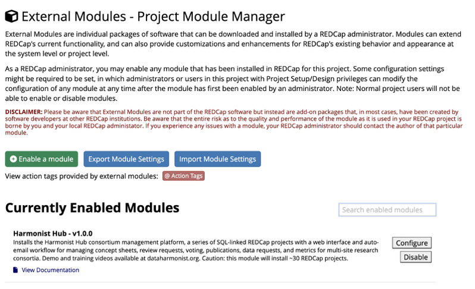
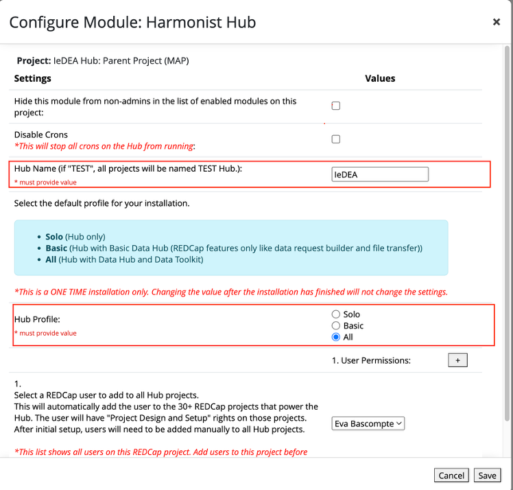
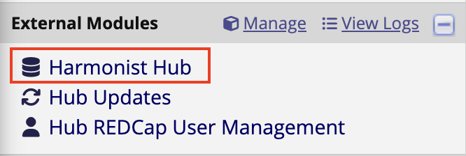
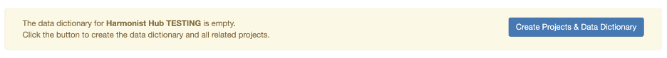

# IeDEA-Harmonist Technical Installation

Before installing the Harmonist Hub External Module, please ensure that you have the following modules downloaded as well:

1. Email Alerts External Module
2. Data Model Browser External Module
3. Get PMID External Module

These modules are dependencies for the Harmonist Hub and will be automatically activated in the projects when you install the Hub.

<h2>1. Harmonist Hub Configuration</h2>

Once a REDCap admin has activated the Harmonist Hub External Module in a project, you need to add some data on the configuration page.

In the configuration window, enter the mandatory fields:

1. Hub Name: This is the name the Hub and the REDCap projects will have. If you enter "TEST", then the Hub will be called "TEST Hub" and the projects will have names like "TEST Hub: Settings (99)" and "TEST Hub: People (5)". We strongly recommend selecting a short name.  
2. Hub Profile: This field is mandatory but any value works. At this time, there is no difference in installation profiles. 

Another interesting field is *User Permissions.* This field allows the admin to add other REDCap users (previously added to the current project) to be part of the installation. This means that as soon as the install starts, these users will also be added to the 30+ REDCap projects that power the Hub. REDCap users need to be added to the current project before their names will appear in the dropdown.

<h2>2. First Time Install</h2>

After configuring the Harmonist Hub External Module, we need to install all the REDCap projects that will make the module work.

1. Click on the new link that will appear in the REDCap sidebar. The first time you see the link, it will read "Harmonist Hub". After installation, that will change to your Hub’s name (e.g., TEST Hub).

   

2. A message will display prompting the user to click the button to create and install the necessary projects to use the external module.

3. Click to install the projects. Keep this window open while the script installs ~30 REDCap projects and links them together with SQL fields. Once the script completes, the Hub External Module installation is complete and you are ready to begin Hub setup by adding data to the projects.
   
4. *Recommended*: Begin the Hub Setup by choosing configuration and display options in the “Settings” project. Next, enter data into the "Research Groups", "People", and "Working Groups" projects. Then customize the intake form and automatic emails in the "Request Manager" project. The Harmonist Hub Setup and Use Guide describes those additional steps.

<h2>3. Data Hub</h2>

If the project also has a Data Hub, please contact a Harmonist lead at harmonist@vumc.org as there are extra steps that need to be taken care of for the tool to work.

<h2>4. Other</h2>

To find more about the Harmonist Hub, please check out these other resources:

- [IeDEA-Harmonist Bootstrap styles modifications](docs/iedea-harmonist-bootstrap-styles-modifications.md)
- [IeDEA-Harmonist Build & Deploy Steps](docs/iedea-harmonist-build-and-deploy-steps.docx.md)
- [IeDEA-Harmonist Data Downloads User Management Utility](docs/iedea-harmonist-data-downloads-user-management-utility.docx.md)