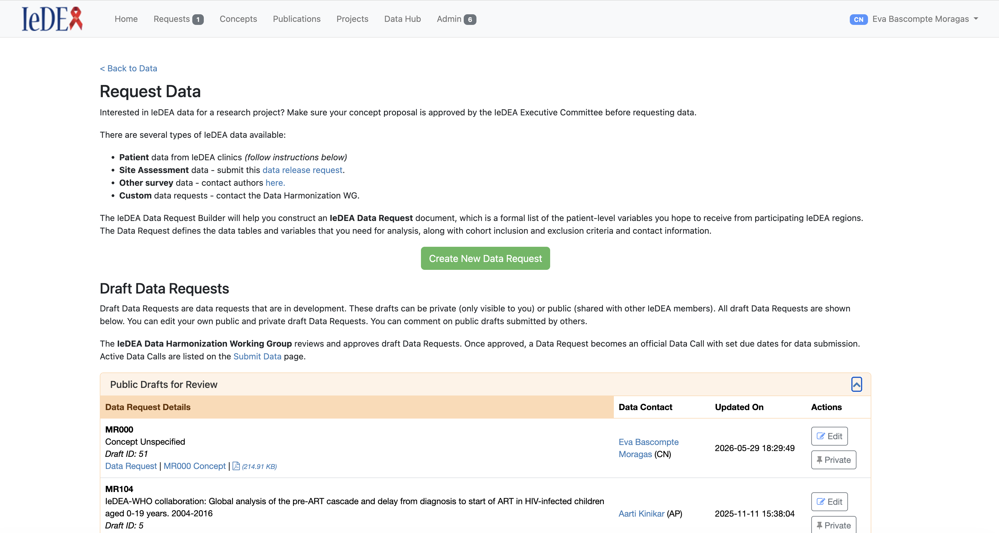
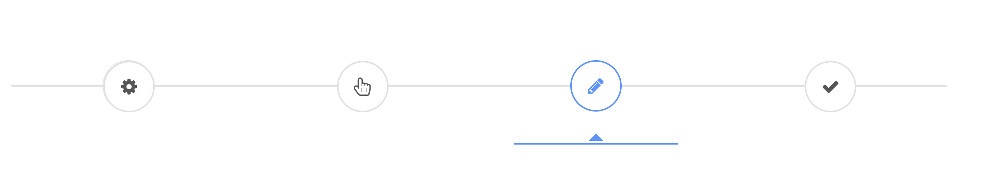
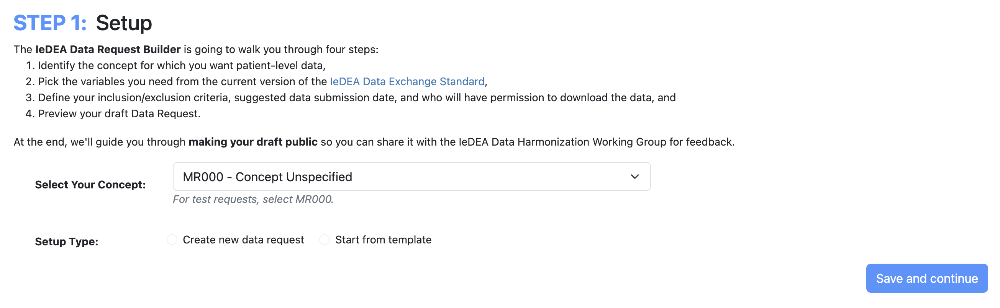

# IeDEA-Harmonist Developer Guide: Data Request Builder

The Data Request Builder helps the user construct an IeDEA Data Request document, which is a formal list of the patient-level variables you hope to receive from participating regions. The Data Request defines the data tables and variables that you need for analysis, along with cohort inclusion and exclusion criteria and contact information.

## 1. Data Request Builder on the Hub

To check the Data Request Builder on the Hub, go to **Data Hub → Create Data Request**.
Here you will be able to see your drafts, create and edit a data request and see the different steps of the data request builder.



## 2. How It Works

All Data Request PHP files are located in the `/sop` folder.

### 2.1. Files Involved

The Data Request Builder is composed of the following files:

| File | Location | Description |
|---|---|---|
| `sop_steps_menu.php` | `sop/` | Main wizard controller. Loads all steps, handles tab navigation, and defines the form submission logic via JavaScript. |
| `sop_step_1.php` | `sop/` | **Step 1 HTML** — Setup: concept selection and setup type (new or from template). |
| `sop_step_1_save_AJAX.php` | `sop/` | **Step 1 AJAX handler** — Creates, loads, or copies a data request record via `DataRequestBuilder`. Returns JSON with all SOP + concept + people data. |
| `sop_step_2.php` | `sop/` | **Step 2 HTML** — Choose Variables: renders DES tables with checkboxes for variable selection. |
| `sop_step_2_save_AJAX.php` | `sop/` | **Step 2 AJAX handler** — Saves selected table fields (`sop_tablefields`) to the SOP record. |
| `sop_step_3.php` | `sop/` | **Step 3 HTML** — Add Details: inclusion/exclusion criteria (TinyMCE editors), study contacts, due date, file format preferences, and data downloaders (drag-and-drop). |
| `sop_step_3_save_AJAX.php` | `sop/` | **Step 3 AJAX handler** — Saves all Step 3 form data (contacts, criteria, downloaders, format preferences) and returns updated data for the preview. |
| `sop_step_4.php` | `sop/` | **Step 4 HTML** — Preview: renders a live PDF-like preview of the Data Request using `DataRequestBuilder::preparePdfHtml()` with `preview=true`. |
| `sop_step_4_save_AJAX.php` | `sop/` | **Step 4 AJAX handler** — Generates the final PDF using Dompdf, stores it in REDCap via `REDCap::storeFile()`, and redirects the user to Step 5. |
| `sop_step_5.php` | `sop/` | **Step 5 HTML** — Completion page: shows the generated PDF in an iframe, offers a ZIP download (PDF + HTML), and provides links to "Route for Review" or "Finalize". |
| `sop_step_5_generate_zip.php` | `sop/` | **Step 5 ZIP generator** — Creates a ZIP archive containing both the stored PDF and an HTML version of the Data Request. |
| `DataRequestBuilder.php` | `classes/` | **Back-end class** — Core business logic for creating, loading, and saving data requests; building PDF HTML; fetching concept/people data; and HTML purification. |
| `DataRequestBuilderStepLoader.js` | `js/` | **Front-end class** — Handles AJAX calls between steps, populates form fields and preview elements from JSON responses, and manages wizard UI state. |
| `tabs-steps-menu.css` | `css/` | Styles for the wizard step menu (round tabs, connecting line, active/disabled states). |

### 2.2. Data Request Builder Menu

1. The Data Request Builder uses a **wizard tab menu** to navigate through the 4 steps (Setup → Choose Variables → Add Details → Preview).



1.1. All styles related to the menu are located in `css/tabs-steps-menu.css`.

2. The menu is rendered by `sop/sop_steps_menu.php`. This file:
   - **Preloads all step HTML** at once (Steps 1–4 are rendered inside `<div class="tab-pane">` elements) so navigation between steps is instant.
   - **Defines all AJAX submission logic** in an inline `<script>` block. Each step's "Save and continue" button triggers a form submit that is intercepted and routed to the correct `sop_step_X_save_AJAX.php` endpoint.
   - **Uses the `DataRequestBuilderStepLoader` JS class** to handle the AJAX call, parse the JSON response, and populate the UI for the next step.
   - **Handles edit mode**: if the URL contains `step=3`, the wizard opens directly on Step 3 (edit mode), enabling all tabs. Otherwise, it defaults to Step 1 (new request mode) with tabs 2–4 initially disabled.

### 2.3. Access Control

Before the wizard is rendered, `sop_steps_menu.php` calls `$routes->canAccessDataRequestBuilder($sop)` (defined in `classes/Routes.php`). Access is granted only when **all** of the following are true:

1. The SOP (Data Request) record is **active** (`sop_active = 1`) and in **draft** status (`sop_status = 0`).
2. The current user is **authorized** — meaning they are either:
  - An admin or a user with Harmonist permissions (`harmonist_perms___1 = 1`), **or**
  - The SOP's creator (`sop_creator`), secondary creator (`sop_creator2`), data contact (`sop_datacontact`), or the hub user who initiated it (`sop_hubuser`).

If no `record` parameter is present in the URL (i.e., the user is starting a new request), access is always granted.

If access is denied, the wizard is not rendered and the user sees:
```
Data Request #<record_id> is not available at this time.
```

### 2.4. The `DataRequestBuilderStepLoader` JavaScript Class

Located at `js/DataRequestBuilderStepLoader.js`, this is the front-end engine that drives the wizard.

**Constructor:**
```javascript
new DataRequestBuilderStepLoader(url, loadAjax, pdfGoToUrl)
```

- `url` — The AJAX endpoint for the current step's save action.
- `loadAjax` — Boolean flag (always `true` in current usage).
- `pdfGoToUrl` — (Optional) The URL to redirect to after PDF generation (used in Step 4 only).

#### How it works

The `DataRequestBuilderStepLoader` acts as a mediator between the wizard form in `sop_steps_menu.php` and the server-side AJAX handlers. Each time the user clicks "Save and continue" (or "Save and stay" on Step 3), the form submit is intercepted and the helper function `loadNextStep()` creates a new `DataRequestBuilderStepLoader` instance, passing the target AJAX URL. It then calls `loadSteps(data, step)`, which:

1. **Posts** the collected form data (checked variables, TinyMCE content, sortable lists, hidden field values) to the server.
2. **Receives** a JSON response containing the full saved SOP record plus computed fields (concept title, people names/emails, formatted dates, etc.).
3. **Dispatches** each key in the JSON to the appropriate UI handler via `processAjaxResponse()` → `dispatchAjaxKey()`. The dispatch logic has three layers:
  - **Dynamic keys** — keys starting with `dataformat_prefer___` are routed to `updatePreferredFormat()`.
  - **Step-specific handlers** — `step3Handlers()` and `otherStepHandlers()` contain named handlers for known fields like `sop_tablefields`, `sop_creator`, `sop_inclusion`, `sop_downloaders`, etc.
  - **Fallback** — any unrecognized key is handled by `updateField()`, which sets the value on matching `#id` and `[preview=...]` elements.
4. **Finalizes** the step by enabling the next wizard tab (`resetMenuButton`), disabling Step 1 options so they can't be changed (`disableStep1Options`), and reinitializing the drag-and-drop sortable lists.

The class also supports **preview binding**: many elements in the Step 4 preview use a custom `preview="..."` HTML attribute. When the loader processes the JSON response, it updates both the form inputs (for the next save) and the preview spans (for real-time display), so the preview always reflects the latest saved state.

For Step 4 specifically, `generatePDF()` is used instead of `loadSteps()`. It sends the record ID to `sop_step_4_save_AJAX.php`, and upon success, redirects the browser to the Step 5 completion page.

**Key methods:**

| Method | Purpose |
|---|---|
| `loadSteps(data, step)` | Main entry point. Sends form data via AJAX to the step's save endpoint, then calls `processAjaxResponse()` to populate the UI with the returned JSON. |
| `generatePDF(recordId, csrfToken)` | Used by Step 4. Sends data to the save endpoint and redirects to the completion page (`pdfGoToUrl`). |
| `processAjaxResponse(jsonAjax, step)` | Iterates over all key/value pairs in the JSON response and dispatches each to the appropriate UI handler. |
| `dispatchAjaxKey(...)` | Routes each JSON key to the correct handler — `step3Handlers` (for loading saved data into Step 3 fields), `otherStepHandlers` (for Step 1 responses), or the generic `updateField()` fallback. |
| `updateTables(data, step)` | Parses `sop_tablefields` (comma-separated `recordId_varIdx` tokens) and checks the corresponding checkboxes in the Step 2 variable table. |
| `updateTinyMCE(key, value)` | Sets content in TinyMCE rich-text editors (used for inclusion/exclusion criteria and notes). |
| `updateDownloadersList(data)` | Moves people from the available list (`#sortable1`) to the selected list (`#sortable2`) via jQuery UI Sortable. |
| `resetMenuButton(step)` | Re-enables a previously disabled wizard tab after a step is completed. |
| `disableStep1Options()` | Locks the Step 1 radio buttons and template selector after the user moves past Step 1, preventing changes to the setup type. |
| `finalizeStep(step, jsonAjax)` | Called after each step save. Enables the next step and refreshes the region drag-and-drop. |

**Data flow per step:**

1. User clicks "Save and continue" → `sop_steps_menu.php` form submit handler fires.
2. Data is collected from the DOM (checked values, form fields, TinyMCE content, sortable lists).
3. `loadNextStep()` creates a `DataRequestBuilderStepLoader` and calls `loadSteps(data, step)`.
4. The loader POSTs to the appropriate `sop_step_X_save_AJAX.php`.
5. The AJAX file uses `DataRequestBuilder` (PHP) to save data to REDCap and returns a JSON response.
6. `processAjaxResponse()` populates the next step's form fields, preview elements, and the Step 4 live preview.

### 2.5. The `DataRequestBuilder` PHP Class

Located at `classes/DataRequestBuilder.php`, this class extends `Model` and contains all server-side business logic for the Data Request Builder.

#### How it works

The `DataRequestBuilder` class is instantiated in every AJAX handler (`sop_step_X_save_AJAX.php`) with the project ID and module reference. It serves two main purposes:

1. **Data lifecycle management** — Creating, loading, copying, and saving SOP (Data Request) records in REDCap. When Step 1 saves, the class determines whether to create a brand-new record (`createNewDataRequest`), copy from an existing template (`createDataRequestFromTemplate`), or reload a draft (`loadDataRequestDraft`). Each method builds a REDCap-compatible data array and saves it using REDCap's `saveData()` function. Subsequent steps (2 and 3) save their specific fields directly in their AJAX handlers, but rely on the class for shared operations like fetching concept data (`getConceptData`) and resolving people information (`getPersonInfo`).

2. **PDF generation** — The `preparePdfHtml()` method is the core output generator. It is called in two modes:
  - **Preview mode** (`preview=true`): Called by `sop_step_4.php` to render a live HTML preview. In this mode, the HTML contains `<span preview="...">` placeholder attributes that get dynamically updated by `DataRequestBuilderStepLoader` on the front end.
  - **Final mode** (`preview=false`): Called by `sop_step_4_save_AJAX.php` to generate the definitive HTML that is fed into Dompdf for PDF creation. This mode includes page numbers, headers, and full styling.

   In both modes, the method assembles the document by calling `pdfFirstPage()` (title page with contacts and due date), `pdfSecondPage()` (introduction, criteria, notes, format preferences), and `prepareRequestedTables()` (DES tables with selected variables). The final HTML is sanitized through `purifyHTML()` using HTMLPurifier with a strict whitelist of allowed tags, attributes, and CSS properties.

   Additionally, `prepareRequestedTables()` builds a `shiny_json` field (a JSON mapping of table names to their selected variable names) and updates the `follow_activity` field to track which users are associated with the request.

**Key methods:**

| Method | Purpose |
|---|---|
| `createNewDataRequest(sopData, conceptId, conceptTitle, createdDt, selectConcept)` | Creates a new SOP record with auto-numbering and initial metadata (status=DRAFT, visibility, dates). |
| `createDataRequestFromTemplate(recordId, conceptId, conceptTitle, createdDt, hubUser)` | Loads an existing finalized SOP (template) and creates a new record copying its table fields, downloaders, criteria, contacts, and format preferences. |
| `loadDataRequestDraft(recordId, createdDt)` | Loads a draft SOP record for editing. Returns the concept data and an update array with the updated timestamp. |
| `getSopData(record, eventId)` | Fetches the full SOP record, replaces special symbols for PDF rendering, initializes region response statuses, and resolves concept + people information. |
| `getConceptData(projectId, conceptId)` | Looks up a concept's ID and title from the HARMONIST project. |
| `getPersonInfo(recordId, key)` | Fetches a person's name and email from the PEOPLE project. |
| `getDataFormatText(data, projectId, module)` | Builds a comma-separated string of preferred file format labels from checkbox data. |
| `preparePdfHtml(module, record, eventId, settings, zipFile, preview)` | **Core PDF builder.** Assembles the full HTML for the Data Request document: logo, first page (contacts, title, due date), second page (introduction, criteria, notes), and requested DES tables. Uses `HTMLPurifier` to sanitize output. Returns `[filename, cleanHtml]` or `[filename, cleanHtml, sopFinalPdf]` for ZIP mode. |
| `prepareRequestedTables(module, record, eventId, data, preview, zipFile)` | Generates the HTML for the requested DES tables section. Also builds and saves the `shiny_json` field (mapping table names to variable lists) and updates the `follow_activity` field. |
| `parseSopTablefields(s)` | Parses the comma-separated `sop_tablefields` string (e.g., `"30_7,30_8,42_1"`) into a structured array grouped by record ID. |
| `replaceSymbolsForPDF(sopData)` | Escapes `>`, `<`, `≥`, `≤` symbols to HTML entities for safe PDF rendering. |
| `pdfFirstPage(settings, data, preview)` | Builds the HTML for page 1 of the PDF: hub name, concept title, data due date, and research/data contacts. |
| `pdfSecondPage(module, projectId, data, preview)` | Builds the HTML for page 2: introduction, inclusion criteria, exclusion criteria, data submission notes, and file format preferences. |
| `purifyHTML(html)` | Runs the assembled HTML through `HTMLPurifier` with a strict whitelist of allowed tags, attributes, and CSS properties. |

### 2.6. Data Request Builder Steps

All step files follow a naming convention: `sop_step_X.php` contains the HTML/UI and `sop_step_X_save_AJAX.php` contains the server-side save logic.

#### 2.6.1. STEP 1: Setup



- **File:** `sop/sop_step_1.php`
- **AJAX:** `sop/sop_step_1_save_AJAX.php`
- **Buttons:** "Save and continue"
- **Purpose:** The user selects a concept from a dropdown (active concepts from the HARMONIST project) and chooses a setup type:
  - **"Create new data request"** (`optradio=1`) — Creates a blank SOP record via `DataRequestBuilder::createNewDataRequest()`.
  - **"Start from template"** (`optradio=2`) — Shows a template dropdown with finalized SOP records (status=2). Copies the selected template via `DataRequestBuilder::createDataRequestFromTemplate()`.
- **AJAX response:** Returns all SOP fields, concept info, people info, and data format text. The `DataRequestBuilderStepLoader` populates Steps 2–4 with any pre-existing data (e.g., when loading a template or draft).

#### 2.6.2. STEP 2: Choose Variables

- **File:** `sop/sop_step_2.php`
- **AJAX:** `sop/sop_step_2_save_AJAX.php`
- **Buttons:** "Save and continue"
- **Purpose:** Displays DES (Data Exchange Standard) tables as an accordion. Each table shows its variables with checkboxes, availability badges, format/code info, and descriptions.
  - Users check individual variables or use "Select All" per table.
  - A counter badge shows how many variables are selected per table.
  - Deprecated variables are hidden.
- **Save:** The checked values are collected as `recordId_varIdx` tokens (e.g., `"30_7"`) and saved to `sop_tablefields` as a comma-separated string.

#### 2.6.3. STEP 3: Add Details

- **File:** `sop/sop_step_3.php`
- **AJAX:** `sop/sop_step_3_save_AJAX.php`
- **Buttons:** "Save and continue" and "Save and stay". The **"Save and stay"** button saves the current data using the same AJAX handler as "Save and continue" (`sop_step_3_save_AJAX.php`) but instead of advancing to Step 4, it remains on Step 3 and shows a confirmation modal (`#modal-save-and-stay`) that auto-dismisses after 25 seconds. This allows users to save their progress without leaving the step.
- **Purpose:** Collects detailed data request information:
  - **Inclusion criteria** — TinyMCE rich-text editor.
  - **Exclusion criteria** — TinyMCE rich-text editor.
  - **Notes** — TinyMCE rich-text editor.
  - **Study contacts** — Research Contact (1 & 2), Data Contact, and Creator Info, all as dropdowns from the PEOPLE project.
  - **Due date** — jQuery UI datepicker.
  - **Preferred file format** — Checkboxes from REDCap choice labels.
  - **File format details** — TinyMCE rich-text editor.
  - **Data Downloaders** — Drag-and-drop with jQuery UI Sortable. Users move people from an available list (`#sortable1`) to a selected list (`#sortable2`), filterable by region.
  - **Optional PDF upload** — For extra documentation.
- **Edit mode:** When `step=3` is in the URL (editing a draft), the page calls `loadNextStep()` with `step='0'` on page load to pre-populate all fields from the saved SOP data.

#### 2.6.4. STEP 4: Preview Data Request

- **File:** `sop/sop_step_4.php`
- **AJAX:** `sop/sop_step_4_save_AJAX.php`
- **Buttons:** "Save and create PDF"
- **Purpose:**
  - **Preview:** `sop_step_4.php` calls `DataRequestBuilder::preparePdfHtml()` with `preview=true` to render a live HTML preview of the Data Request document. The preview uses `<span preview="...">` attributes that are dynamically updated by `DataRequestBuilderStepLoader` as data changes.
  - **Save:** When the user clicks "Save and create PDF", the AJAX handler generates the final PDF using **Dompdf**, stores it in REDCap's `redcap_edocs_metadata` table, and saves the `doc_id` to the SOP record's `sop_finalpdf` field. The user is then redirected to Step 5.

#### 2.6.5. STEP 5: Completion

- **File:** `sop/sop_step_5.php`
- **ZIP Generator:** `sop/sop_step_5_generate_zip.php`
- **Purpose:** This is the post-wizard completion page (not part of the 4-step wizard UI). It:
  - Displays a success message.
  - Embeds the generated PDF in an iframe.
  - Offers a **ZIP download** (PDF + HTML version of the Data Request) via `sop_step_5_generate_zip.php`.
  - Provides links to: "View in My Drafts", "Route for Review", "Back to Edit Data Request" (returns to Step 3), and for admins, "Finalize Data Request" (opens a REDCap survey in a modal).

## 3. Architecture Diagram

```
┌──────────────────────────────────────────────────────────────────────┐
│                         sop_steps_menu.php                           │
│    (Wizard container: tabs, form, JS submit handlers)                │
│    Access check: $routes->canAccessDataRequestBuilder($sop)          │
│                                                                      │
│  ┌──────────┐  ┌──────────┐  ┌───────────────┐  ┌──────────┐       │
│  │  Step 1   │  │  Step 2   │  │    Step 3      │  │  Step 4   │    │
│  │ (tab-pane)│  │ (tab-pane)│  │  (tab-pane)    │  │ (tab-pane)│    │
│  │           │  │           │  │               │  │           │     │
│  │sop_step_1 │  │sop_step_2 │  │ sop_step_3    │  │sop_step_4 │    │
│  │  .php     │  │  .php     │  │   .php        │  │  .php     │    │
│  └─────┬─────┘  └─────┬─────┘  └──┬────────┬──┘  └─────┬─────┘    │
│        │              │            │        │           │           │
│   Save &          Save &      Save &    Save &     Save &         │
│   Continue        Continue    Continue  Stay       Create PDF      │
└────────┼──────────────┼────────────┼────────┼───────────┼──────────┘
         │              │            │        │           │
         │              │            └────┬───┘           │
         │              │                 │               │
    DataRequestBuilderStepLoader.js  (loadSteps / generatePDF)
         │              │                 │               │
         ▼              ▼                 ▼               ▼
  ┌────────────┐ ┌────────────┐ ┌──────────────┐ ┌────────────┐
  │ step_1_save│ │ step_2_save│ │ step_3_save   │ │ step_4_save│
  │ _AJAX.php  │ │ _AJAX.php  │ │ _AJAX.php     │ │ _AJAX.php  │
  └──────┬─────┘ └──────┬─────┘ └──────┬───────┘ └──────┬─────┘
         │              │              │                 │
         └──────────────┴──────┬───────┴─────────────────┘
                               │
                               ▼
                    DataRequestBuilder.php
                   (classes/DataRequestBuilder)
                               │
                    ┌──────────┴──────────┐
                    │   REDCap Functions   │
                    │ (getData, saveData)  │
                    └─────────────────────┘
                               │
                               ▼
                        ┌─────────────┐
                        │  sop_step_5 │  ← Completion page
                        │   .php      │     (PDF view, ZIP download,
                        │             │      Route for Review)
                        └─────────────┘
```
